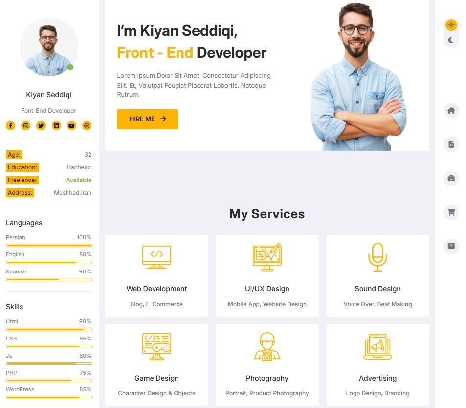

## Portfolio (Vanilla JS)
> General Template and design is a figma file and I added some features to it for practice more Vanilla JavaScript and Sass. this is my second project in first days of learning Front-End developing.

### Features:
- Dark mode
- Responsive design
- Dynamic slider
- Dynamic Progress bar
- Gallery slider for images

 
